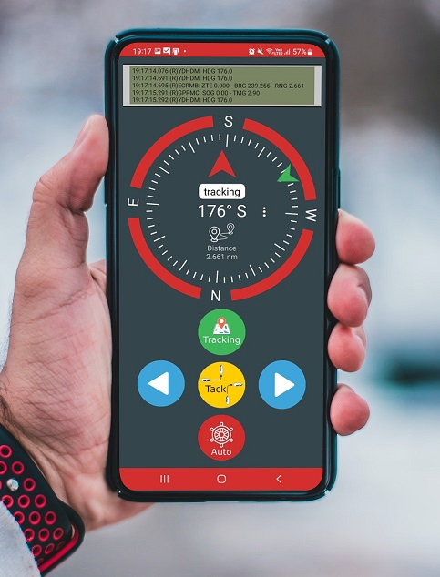
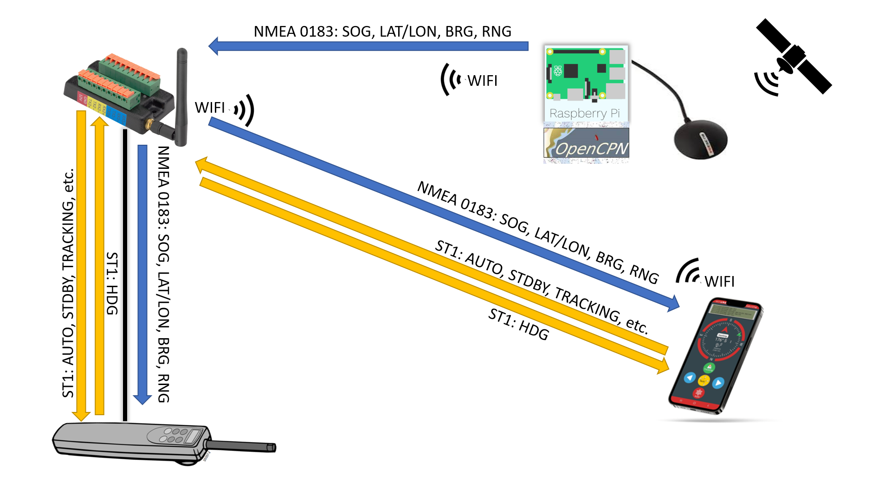
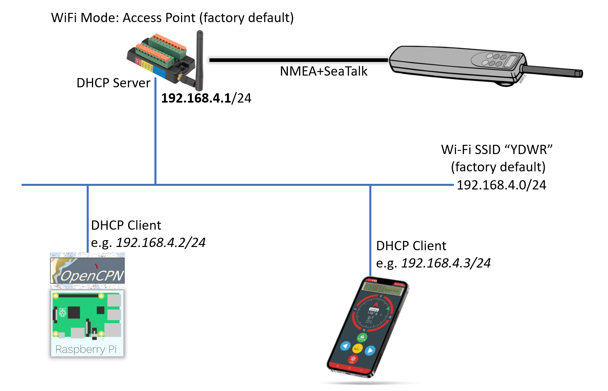
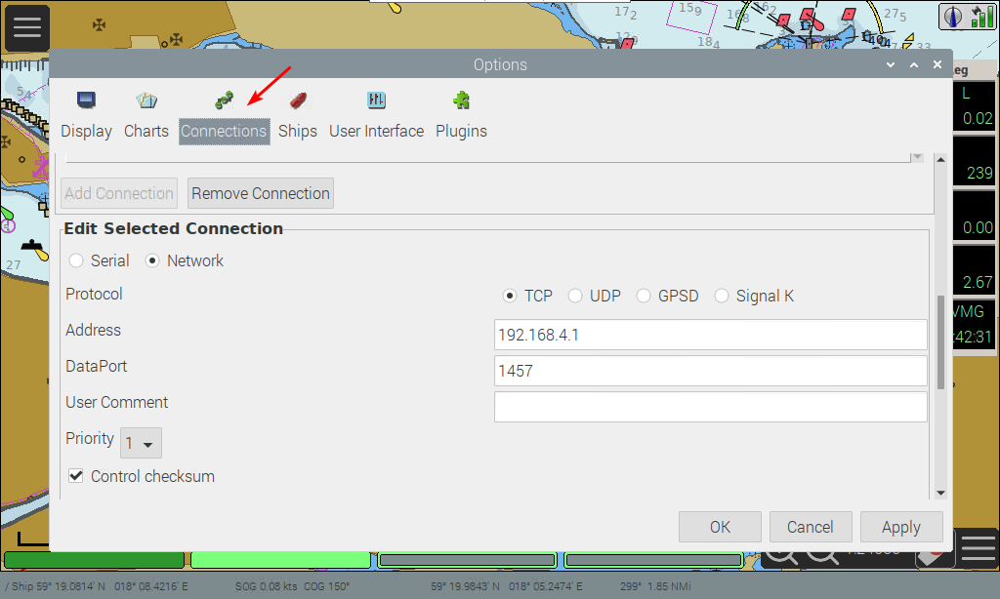
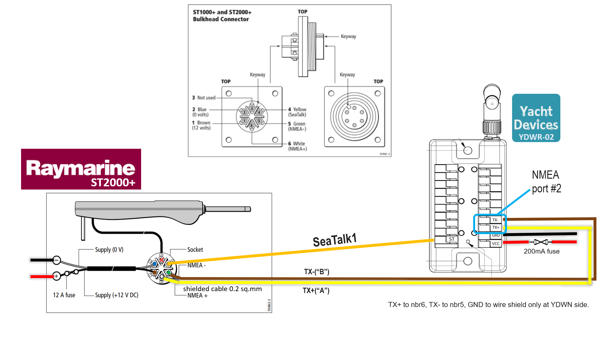
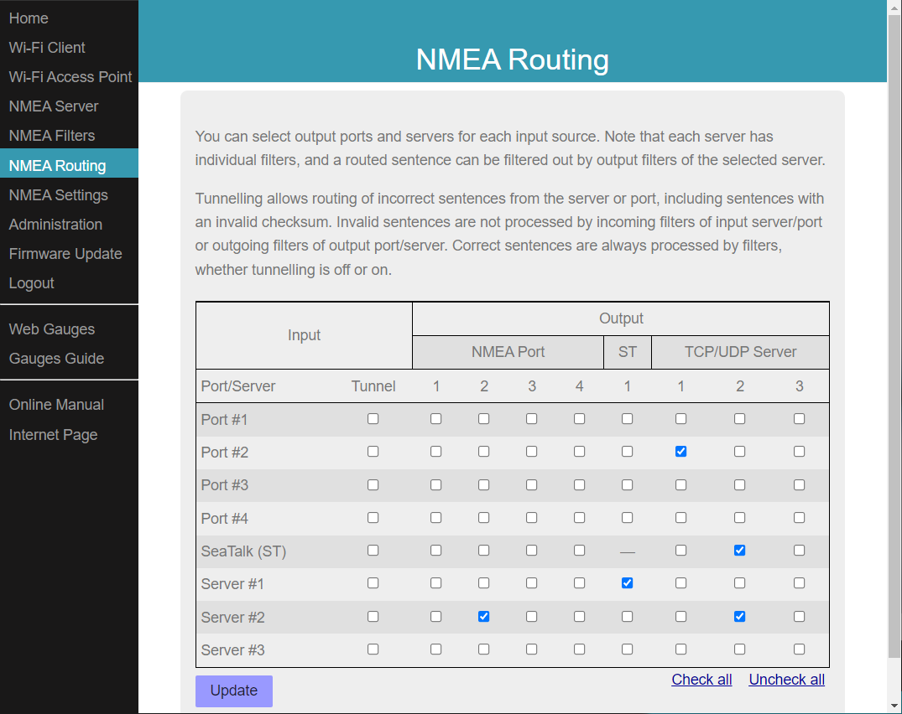
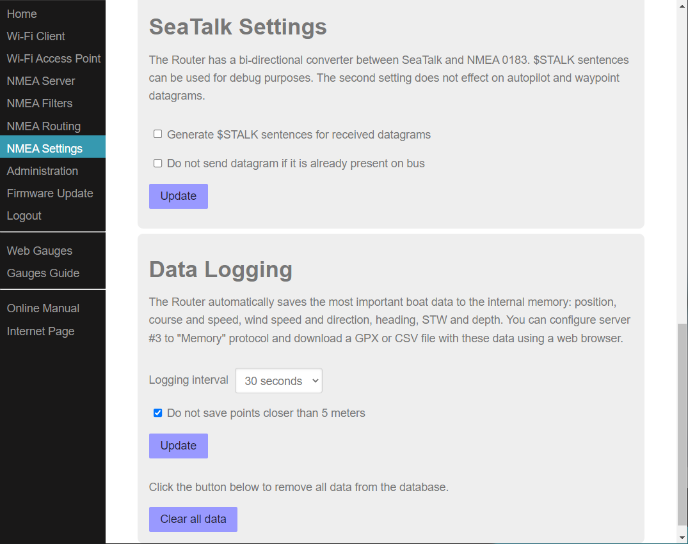
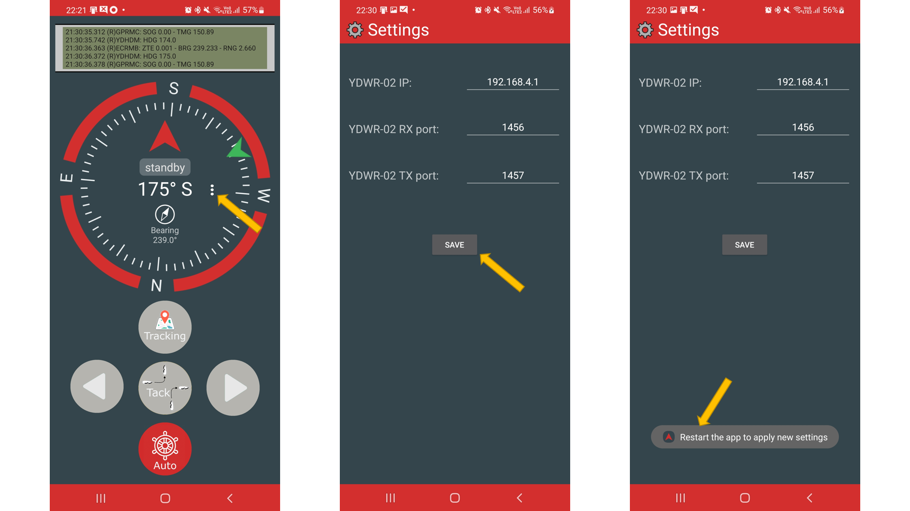

#  STxMobile

**STxMobile** is a proof of concept of an Android app for remotely controlling the Raymarine[Raymarine ST2000+](https://www.raymarine.com/autopilot/evolution-autopilot/st1000-st2000-tiller-pilots/) tiller pilot from an Android phone. 

The application has been developed using the [NMEA 0183 Wi-Fi Router YDWR-02](https://www.yachtd.com/products/wifi_0183_router.html) for routing NMEA data from [openCPN](https://opencpn.org/) to both the Raymarine ST2000+ and to the application, as well as to route SeaTalk data between the application and the Raymarine ST2000+.

# Networking
The YDWR-02 device can work in Access Point mode (factory default) and in Client mode when it is connected to an existing Wi-Fi network.
See [YDWR-02 User Manual](https://www.yachtd.com/downloads/ydwr02.pdf) for more information.

In the example below, the YDWR-02 is in Access Point mode and acts as DHCP server.

# Configuration

## openCPN
Add a connection on openCPN to send NMEA data to the YDWR-02 device

## NMEA 0183 Wi-Fi Router YDWR-02
### Installation
In the example below auto tiller is connected to port #2 and to the SeaTalk1 port.

### Configuration
#### Servers
* Server #1 is used to receive SeaTalk sentences from the application.
* Server #2 is used to receive NMEA data from openCPN and to route to the application.

#### Routing

#### SeaTalk
Verify that the SeaTalk settings are as below.

## STxMobile
Click the three dots icon to access the settings page.
> Note that currently the app needs to be restarted to read and apply new settings.

# Verified with

* Samsung Galaxy S21 plus
* [Raymarine ST2000+](https://www.raymarine.com/autopilot/evolution-autopilot/st1000-st2000-tiller-pilots/) 
*   [NMEA 0183 Wi-Fi Router YDWR-02](https://www.yachtd.com/products/wifi_0183_router.html)

# Credits
Color palette and compass rose based on the beautiful app [Compass ](https://play.google.com/store/apps/details?id=net.androgames.compass&hl=en&gl=US)  made by PixelProse SARL.
